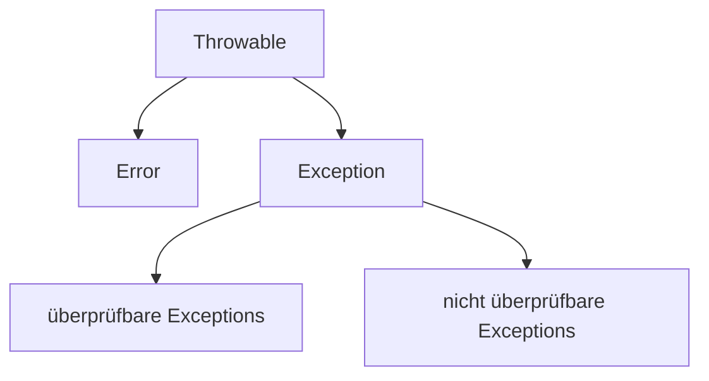

- Unterklassen von Error sind meistens unrecoverbar (StackOverflowError, OutOfMemoryError)
- nicht überprüfbare Exceptions: vom System definiert, meisten nicht überprüfbar, z.B. **RuntimeExceptions**

Oft ist es sinnvoll **Exceptions** abzufangen und an einer geeigneten stelle weiter zu machen
```Java
try {...}
catch(CustomException e){...}
catch(Exception e){...}
finally{...} // finally wird immer zum Schluss ausgeführt auch wenn kein catch 
             // ausgelöst wurde.
```
```Java
class A {  
	void foo() throws Help, SyntaxError { ... }  
}  

class B extends A {  
	void foo() throws Help { ... }  
}
```
**throw** in B darf nur noch spezifischer werden oder gleich bleiben aber nicht neue Exceptions hinzufügen die kein Untertyp von den Exceptions in A sind

### Einsetzen von Ausnahmebehandlungen
#### 1) Unvorhergesehene Programmabbrüche
wird eine Exception nicht abgefangen bricht das Programm ab und der Stacktrace wird ausgegben (Debugging)
#### 2) Kontrolliertes Wiederaufsetzen
Kann leider keine echten Programmfehler beheben. Fortsetzen bei einem Punkt wo es möglich ist ohne Fehler.
#### 3) Ausstieg aus Sprachkonstrukten
Abbrechen der Ausführung von Blöcken, Kontrollstrukturen, Methoden, etc. in außergewöhnlichen Situationen.
#### 4) Rückgabe alternativer Ergebniswerte
Es gibt nur einen Rückgabetyp, kann umgangen werden indem das Throwable Objekt zurückgegeben wird.

#### Faustregel: Aus Gründen der Wartbarkeit soll man Ausnahmen und Ausnahmebehandlungen nur in echten Ausnahmesituationen und sparsam einsetzen.

#### Faustregel: Man soll Ausnahmen nur einsetzen, wenn dadurch die Programmlogik vereinfacht wird.
- es ist aber nur sinnvoll wenn die Exception lokal abgefangen wird

```Java
while (x != null)  
	x = x.getNext(); // 2 überprüfungen auf null

try {  
	while(true)  
		x = x.getNext();  
	}  
catch(NullPointerException e) {}
```

#### Faustregel: Bei der Verwendung von Ausnahmen müssen nicht-lokale Effekte beachtet werden.
Typabfragen mit Exceptions:
```Java
if (x instanceof T1) { ... }  
else if (x instanceof T2 { ... }  
...  
else if (x instanceof Tn { ... }  
else { ... }
```
```Java
try { throw x; }  
catch(T1 x) { ... }  
catch(T2 x) { ... }  
...  
catch(Tn x) { ... }  
catch(Exception x) { ... }
```
T1 bis Tn müssen Unterklassen von Exception sein

Beides schlechter Programmierstil weil Typabfragen sollten vermieden werden um die Wartbarkeit zu verbessern

```Java
public static String addA(String x, String y) {  
	if (onlyDigits(x) && onlyDigits(y)) { ... }  
	else  
		return "Error";  
}
```
Schlecht weil immer verglichen werden muss ob der String "Error" ist oder nicht

```Java
public static String addB(String x, String y) throws NoNumberString {  
	if (onlyDigits(x) && onlyDigits(y)) {... }  
	else  
		throw new NoNumberString();  
}
```
Verwendung ist zwar nicht lokalaber spezielle Ergebniswerte würden auch nicht-lokal Abhämgigkeiten erzeugen.

[[Nebenläufige Programme|Next]]
