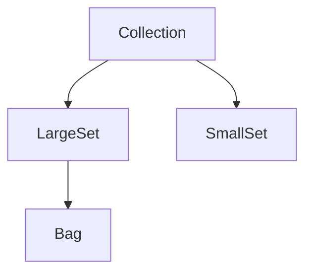
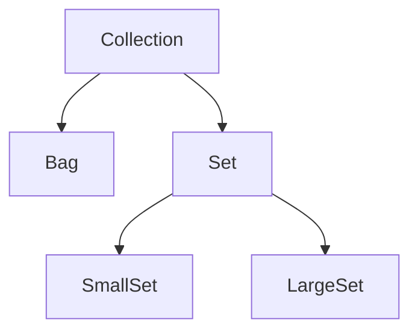

### Abstakte Klassen
- Klassen von denen keine Objekte erzeugt werden
- wid zum Zusammenfassen von Subtypes verwendet

### Interfaces
- spezielle Abstrakte Klassen die keine Objektvariablen beschreiben dürfen
- jede Variable ist static final
- abstract nicht notwendig
- Methoden und Konstanten public
- Mehrfachvererbung möglich

### Vererbung vs. Ersetzbarkeit
#### Untertypbeziehung
- Ersetzbarkeit
- Vererbung irrelevant
- indirekte Codewiederverwendung (langfirstig wichtiger), weniger direkte Verwendung da Zusicherungen zu berücksichtigen

#### Vererbungsbeziehung
- Klassen ensteht aus Oberklasse etc.
- Ersetzbarkeit irrelevant
- Direkte Codewiederverwendung

#### Reale-Welt-Beziehung
- Beziehung: Einheit - Entwurf
- intuitiv

Untertypbeziehung setzt Vererbung vorraus und Vererbung Untertypbeziehung (soweit wie Compiler prüfbar)


reine Vererbung schlecht

Untertypbez. gut

#### Direkte Codewiederverwendung
- Code nur einmal geschrieben
- nötige Änderungen an der jeweiligen Stelle
- Nachteil: hohe Abhängigkeit zwischen Ober und Unterklasse

#### Verdeckung vs Überschreiben
- Variablen gleichen Namens in Ober- und Unterklasse:  
- Variable in Unterklasse verdeckt Variable in Oberklasse, verdeckte Variable zugreifbar: super.var  
  ((Oberklasse)this).var 

- Methoden gleichen Namens in Ober- und Unterklasse:  
- Unterklassenmethode überschreibt Oberklassenmethode, überschriebene Methode zugreifbar: super.method(...); aber kein Zugriff über ((Oberklasse)this).method(...)

#### Statisch geschachtelte Klassen
```Java
class EnclosingClass {  
	...  
	static class StaticNestedClass { ... }  
	...  
}
a = new EnclosingClass.StaticNestedClass();
```
#### Innere Klassen
```Java
class EnclosingClass {  
	...  
	class InnerClass { ... }  
	...  
}
a = new EnclosingClass();
b = a.new InnerClass();
```

#### Sichtbarkeit
|                   | public | protected | - | private |
|-------------------|--------|-----------|---|---------|
| sichtbar (Paket)  | J      | J         | J | N       |
| sichtbar (Global) | J      | N         | N | N       |
| erbbar (Paket)    | J      | J         | J | N       |
| erbbar (Global)   | J      | J         | N | N       |


[[WHF2|Next]]
