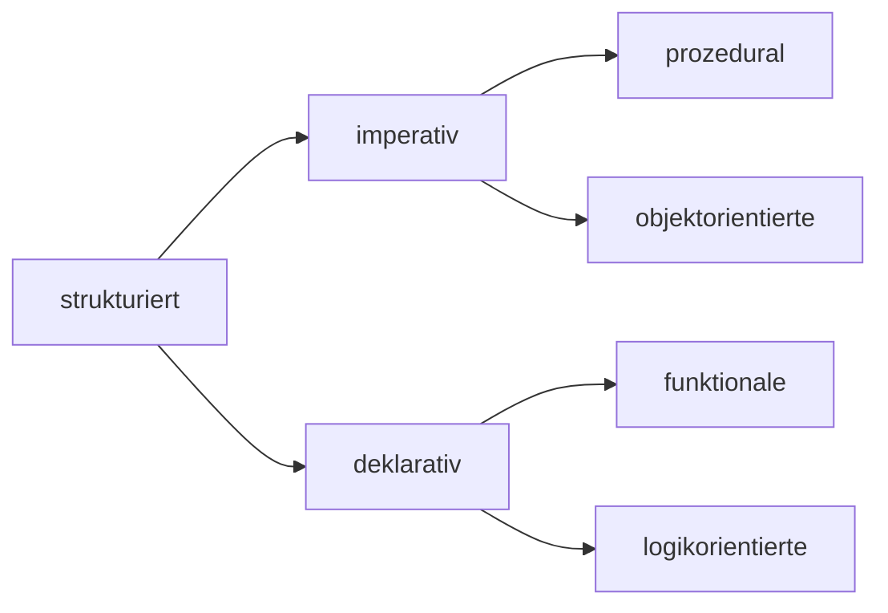

## Berechnungsmodell

- Müssen in sich konsistent und Turingvollständig sein (alles ausdrücken können, was als berechenbar gilt)

## Formalismen
### Funktionen
- Primitiv rekursive Funktionen 
	- können erst alles durch $\mu$-rekursive Funktionen berechnen ($\mu$ gibt dabei das kleinste Ergebnis zurück angewendet auf Partielle Funktionen; Auswertung der Funktion so weit wie möglich)
	- bildung neuer Funktionen durch Rekursion und Komposition

- $\lambda$-Kalkül (gut zum beschreiben transformatorischer Systeme)

### Prädikatenlogik
- obvious (und, oder, not, ...)

#### Constraint Porgrammierung 
- z.B. x > 5 und A oder B ist wahr (praktisch für Beweise)

### Temporale Logik & Petri-Netze
- Temporale Logik: Logik mit zeitlicher Abhängigkeit (synchronisation)
- Sind ineinander umwandelbar

### Freie Algebren
- Spezifikation beliebiger Funktionen über einfache Axiome

### Prozesskalkül
- spezielle Algebren vergleichbar mit Threads
- CSP (Communicating Sequential Process)
- $\pi$-Kalkül (gut zum beschreiben reaktiver Systeme)
	- Endlos Prozesse wohldefeniert, aber Deadlocks möglich
- Primitive Funktionen zum senden und empfangen von Daten

### Automaten
- Grammatiken etc.
- die mächtigsten sind Turing Vollständig

### WHILE, GOTO, etc.

[[Praktische Realisierung|Next]]  
