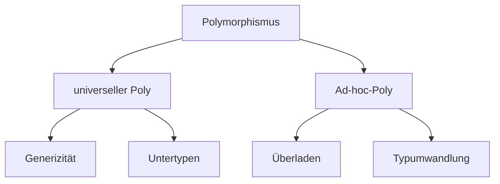

### Fundiertheit:
Existenz einer nicht rekursiven alternative bei rekusiven Datenstrukturen

### Objekt:
- grundlegende Modularisierungseinheit
- Identität
	- Name vom Objekt
- Zustand
	- Werte der Variablen etc.
- Verhalten
	- Methoden etc.

### Interface:
beschreibt das Verhalten des Objekts in einem Abstraktionsgrad

### Klasse:
- beschreibt Struktur der Objekte
- Konstruktoren zur Initialisierung der Objekte 

### Polymorphismus

### Kovarianz(in Richtung der Vererbung; Rückgabeparameter):
*A verhält sich zu B wie T zu U* 
Typ von Element im Untertyp ist Untertyp des Elementtyps im Obertyp

Ersetzbarkeit bei Lesezugriff auf Konstante, Ergebnis, Ausgangsparameter  
nur Elementtyp A im Obertyp T statisch bekannt  

Lesezugriff kann tatsächlich auf Element vom Typ B in U erfolgen  

gelesener Wert soll vom erwarteten Typ A sein: 
→ Instanz von B auch Instanz von A  
→ B Untertyp von A

deklarierte Typen von Konstanten und von Ergebnissen der Methoden sowie von Ausgangsparametern

### Kontravarianz(entgegen der Vererbung; Eingabeparameter)
*A verhält sich zu B umgekehrt wie T zu U*
Typ von Element im Untertyp ist Obertyp des Elementtyps im Obertyp

Ersetzbarkeit bei Schreibzugriff auf Eingangsparameter  
nur Parametertyp A im Obertyp T statisch bekannt  

Schreibzugriff kann tatsächlich auf Parameter vom Typ B in U erfolgen  

geschriebener Wert vom Typ B obwohl Werte vom Typ A schreibbar  
→ Instanz von A auch Instanz von B  
→ A Untertyp von B

deklarierte Typen von formalen Eingangsparametern

### Invarianz
gleichzeitig Ko- und Kontravarianz
Typ von Element im Untertyp ist äquivalent zu Elementtyp im Obertyp

Ersetzbarkeit bei schreibendem und lesendem Zugriff

deklarierte Typen von Variablen und Durchgangsparametern
